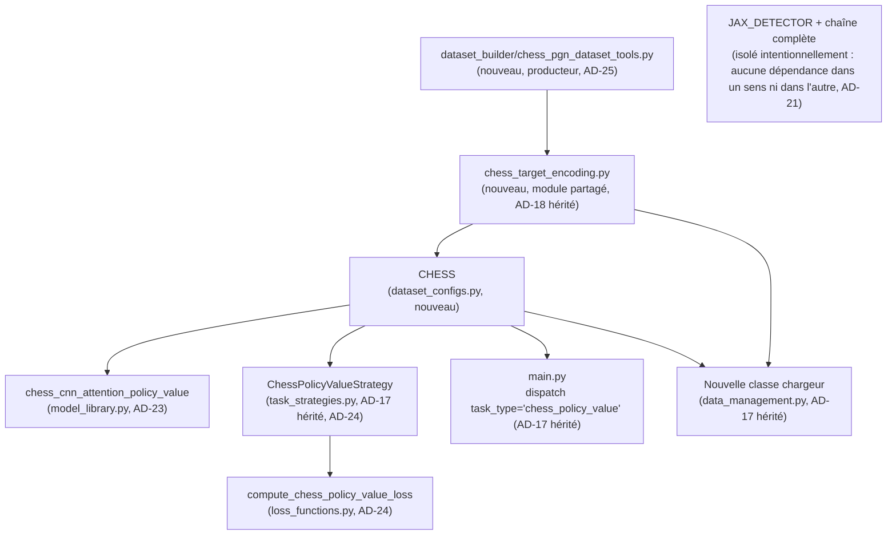

# Architecture Spine — Epic échecs — preuve de généralisation policy/value

## Design Paradigm

L'entraînement reste **Strategy + Factory + Dependency Injection** (`main.py`/`Trainer`/`TaskStrategy`/`model_library.get_model()`), hérité sans changement du spine parent — le domaine échecs s'y insère comme une nouvelle stratégie/classe/config, pas une exception au pattern. C'est le test même de cette epic (PRD §1 Vision) : le pattern doit absorber une sortie policy+value sans que sa forme change.

La seule nouveauté architecturale locale est confinée au **modèle** échecs lui-même : un bottleneck de **tokens appris par requêtes** (Perceiver/TokenLearner-style — cross-attention entre les features spatiales du CNN 8×8 et un petit nombre de vecteurs de requête appris), suivi de self-attention **standard** entre ces tokens (pas de biais géométrique cette epic, voir Deferred). C'est la première fois que ce codebase utilise un mécanisme d'attention transformer multi-têtes (`SpatialAttention`/SE existants sont du gating convolutif, pas du self-attention) — mais `flax.linen` le fournit déjà nativement (Stack), donc cette nouveauté n'introduit aucune nouvelle dépendance, seulement un nouveau bloc dans `model_library.py`.

## Inherited Invariants

| Inherited | From parent | Binds here |
| --- | --- | --- |
| AD-3 [ADOPTED] | architecture-jax_supervised_training-2026-07-15 (via architecture-JAX_Detection-2026-07-12) | Le chargement du checkpoint échecs applique le même fallback de chemin 3 niveaux + réinit des `batch_stats` manquants que tout autre modèle — aucun chargement nu spécifique. |
| AD-14 | architecture-jax_supervised_training-2026-07-15 | Le domaine échecs s'entraîne comme une config/stratégie séparée et modulaire, jamais fusionné à l'entraînement d'un autre domaine — aucun graphe d'inférence unifié n'existe ni n'est requis par cette epic (l'inférence/intégration `chess_game.py` est un Non-Goal, PRD §5). |
| AD-17 | architecture-jax_supervised_training-2026-07-15 | Le domaine échecs obtient sa propre classe `TaskStrategy` et sa propre classe de chargeur de données (§ AD-24 ci-dessous) — jamais une branche conditionnelle sur `ClassificationStrategy`/`DetectionStrategy`/`CenterNetDetectionStrategy`/`KeplerStrategy` existantes. Le littéral `task_type="chess_policy_value"` est défini une seule fois et référencé identiquement aux **2 points de dispatch réels**, vérifiés dans le code actuel : `main.py:121-166` (sélection de la classe `Strategy`) et `data_management.py:613-664` (sélection de la classe chargeur). Note de correction : le texte du parent (AD-17) cite aussi `task_strategies.py` comme 3ᵉ point — vérifié faux dans le code actuel (`task_strategies.py` ne contient aucun dispatch par `task_type`, les classes `Strategy` y sont instanciées directement par `main.py`) ; le parent n'est pas modifié rétroactivement, mais ce spine s'aligne sur la réalité du code plutôt que de répéter l'inexactitude. |
| AD-18 | architecture-jax_supervised_training-2026-07-15 | Le format d'échange producteur/consommateur (position encodée en planes façon AlphaZero + historique 5 coups, cibles policy/value) est défini par un **module dédié unique** (`chess_target_encoding.py`, miroir direct de `detection_target_encoding.py` — même rôle, même structure), jamais réimplémenté indépendamment côté builder dataset et côté `data_management.py`/`TaskStrategy`. |

## Invariants & Rules

### AD-21 — Non-régression : `JAX_DETECTOR` reste pleinement fonctionnel, sans aucun impact

- **Binds:** `JAX_DETECTOR` (config `dataset_configs.py`), `aircraft_detector_centernet`/`aircraft_detector_centernet_lite` (modèles), `CenterNetDetectionStrategy`, `CenterNetDetectionDataset`, tous leurs consommateurs actuels
- **Prevents:** un builder qui, en ajoutant le dispatch `chess_policy_value` (AD-17) ou une nouvelle classe partagée, modifie par erreur un chemin de code encore emprunté par `JAX_DETECTOR` ; toute régression silencieuse non détectée faute de comparaison à une baseline.
- **Rule:** `JAX_DETECTOR` et toute sa chaîne (entraînement et inférence) restent utilisables de bout en bout, **sans modification fonctionnelle**, pendant et après cette epic. Aucune story de cette epic ne modifie `CenterNetDetectionStrategy`, `CenterNetDetectionDataset`, `aircraft_detector_centernet(_lite)`, ou tout fichier `tools/` qui en dépend. Validé par exécution réelle — comparaison par diff à une baseline (boxes/classes/scores sur un set fixe d'images) capturée avant l'epic (PRD FR-7), jamais par lecture de code seule. Même précédent qu'AD-20 (parent), appliqué ici à `JAX_DETECTOR` qu'AD-20 ne couvre pas.

### AD-22 — Policy : espace de sortie fixe, sans masquage des coups illégaux cette epic

- **Binds:** modèle `chess_cnn_attention_policy_value` (tête policy), `chess_target_encoding.py`, `ChessPolicyValueStrategy.compute_loss`/`compute_metrics`
- **Prevents:** un builder qui fait transiter le plan des coups légaux jusqu'à la loss pour masquer les logits illégaux avant la cross-entropy — complexité de flux de données non nécessaire pour un entraînement par imitation (le coup cible est toujours un coup légal réellement joué) et hors du périmètre de cette epic (la sélection de coup à l'inférence, seul contexte où le masquage a un rôle réel, est un Non-Goal — PRD §5).
- **Rule:** la tête policy produit un vecteur de taille fixe sur l'espace de coups façon AlphaZero (schéma d'encodage coup→index exact fixé dans `chess_target_encoding.py`, AD-18). La loss est une cross-entropy simple contre l'index du coup joué, sans masque. `compute_metrics` (top-1 policy accuracy) compare directement l'argmax du modèle à l'index cible, sans masque non plus — un top-1 illégal est simplement compté comme faux, pas filtré. La légalité des coups (y compris cas spéciaux : roque, promotion, prise en passant) est garantie par construction côté labels, `python-chess` gérant ces règles lors du rejeu PGN (PRD FR-1) — le modèle n'a pas besoin de les connaître pour cette epic. **Taille de l'espace de sortie à source unique :** `chess_target_encoding.py` définit une constante nommée unique (ex. `NUM_MOVES`) pour la taille de cet espace. L'entrée `CHESS` de `dataset_configs.py` fixe son champ `num_classes` à cette même constante (importée, jamais un littéral dupliqué) — ce champ existe déjà dans le flux générique (`main.py:110`, `model_kwargs = {"num_classes": ..., "dropout_rate": ...}`, passé à tout `get_model()` sans plomberie nouvelle) et dimensionne ainsi la tête policy du modèle sans second point de vérité.

### AD-23 — Bottleneck : tokens par requêtes apprises, pas par pooling

- **Binds:** modèle `chess_cnn_attention_policy_value` (bloc bottleneck)
- **Prevents:** un builder qui implémente un pooling par groupe de canaux (option plus simple mais rejetée) là où des requêtes apprises sont attendues — deux implémentations du bottleneck non interchangeables changeraient la capacité et le comportement du modèle sans que ce soit visible en lecture rapide du reste du pipeline.
- **Rule:** le bottleneck réduit les features spatiales du CNN 8×8 à K tokens via cross-attention entre ces features et K vecteurs de requête **appris** (paramètres du modèle, style Perceiver/TokenLearner) — pas de pooling par groupe de canaux. Auto-attention **standard** (`nn.MultiHeadDotProductAttention` de `flax.linen`, sans biais géométrique) entre les K tokens ensuite. La valeur exacte de K est un hyperparamètre laissé à l'implémentation (story), pas fixée ici.

### AD-24 — `TaskStrategy` échecs : loss composite zero-touch Trainer, policy accuracy en métrique primaire

- **Binds:** nouvelle classe `ChessPolicyValueStrategy` (`task_strategies.py`), `loss_functions.py` (nouvelle fonction), `trainer.py` (à ne PAS modifier)
- **Prevents:** un builder qui, pour rendre `policy_loss`/`value_loss` visibles séparément à chaque epoch, modifie `trainer.py` (sa boucle de log ne gère aujourd'hui qu'un scalaire de loss et un scalaire de métrique par step, vérifié `trainer.py:245-274,493-499`) — changement structurel non nécessaire et qui outrepasse le critère de succès de cette epic (PRD SM-1/FR-6) ; une confusion sur quelle tête (policy ou value) gate la sauvegarde du "best model".
- **Rule:** `compute_loss` retourne une **loss unique**, `policy_weight * policy_loss + value_weight * value_loss`, exactement sur le modèle de `compute_centernet_loss` (`loss_functions.py:547`, deux termes pondérés combinés en un scalaire). Aucune modification de `trainer.py`. Le détail `policy_loss`/`value_loss` séparé n'est PAS exposé dans le log epoch-par-epoch de `Trainer` — il est calculé et affiché uniquement en fin d'entraînement, dans `generate_reports()` (hook déjà existant par stratégie, pas de changement d'interface). `primary_metric_name = "PolicyAccuracy"` (top-1), `optimization_mode = "max"` — c'est la métrique qui gate la sauvegarde du best model ; la value head est entraînée (contribue à la loss composite) mais ne gate rien.
  **Value head — forme et loss (cohérent avec le PRD Glossaire : "évaluation scalaire") :** sortie scalaire (`Dense(1)` + `tanh`, borne `[-1, 1]`), loss de régression (MSE) contre la cible +1/0/-1 — pas une classification 3-voies. Précision non ambiguë pour un futur builder.
  **Source unique des poids et du détail par tête :** `policy_weight`/`value_weight` et les fonctions de sous-loss vivent uniquement dans `compute_chess_policy_value_loss` (`loss_functions.py`), passés à l'instanciation de `ChessPolicyValueStrategy` via `loss_params` — même pattern que `CenterNetDetectionStrategy.__init__(self, loss_params)` déjà existant. `generate_reports()` réutilise `self.loss_params` et rappelle les mêmes sous-fonctions de `loss_functions.py` pour afficher le détail policy/value — il ne redéfinit ni ne duplique les poids ou le calcul indépendamment.

### AD-25 — Format d'exemple dataset minimal : position + policy + value uniquement

- **Binds:** `dataset_builder/chess_pgn_dataset_tools.py` (nouveau, producteur), `chess_target_encoding.py`, nouvelle classe de chargeur `data_management.py` (consommateur)
- **Prevents:** un builder qui ajoute des champs de métadonnée (cadence de jeu, code ECO d'ouverture) au format d'exemple "au cas où" — chaque champ supplémentaire est une divergence possible entre producteur et consommateur (AD-18) pour un usage non requis cette epic (PRD Open Question #5, explicitement reporté) ; un builder qui, face à un signal value bruité (risque documenté au PRD, addendum du brief), réintroduit un moteur externe (Stockfish ou autre) pour re-labelliser — exclu par NFR-2, non négociable ce cycle ; deux points qui recalculent chacun le signe de la value de façon indépendante et divergente.
- **Rule:** la policy imite tous les coups joués (Blancs et Noirs, gagnant et perdant confondus), jamais filtrée par le résultat de la partie (PRD FR-3) — seule la value porte le résultat. Chaque exemple de dataset porte exactement 3 informations : position encodée (planes + historique 5 coups), cible policy (index de coup), cible value (+1/0/-1). Aucun champ de cadence, d'ECO, ou d'identité de partie/joueur n'est persisté. Une story future qui aurait besoin de cette métadonnée re-parse le PGN brut — accepté comme coût différé (PRD Assumptions/Open Questions). `chess_pgn_dataset_tools.py` ne dépend d'aucun moteur d'échecs externe — seul `python-chess` (légalité, rejeu PGN) est utilisé ; aucun binaire/API Stockfish ou équivalent n'entre dans la génération des labels (NFR-2). Le **producteur calcule et fige le signe de la value** (résultat de partie du point de vue du joueur au trait à cette position précise) une seule fois, au moment de l'écriture de l'exemple — le consommateur (`data_management.py`, `ChessPolicyValueStrategy`) lit la valeur stockée telle quelle, ne la re-dérive et ne l'inverse jamais.

### Dépendances (qui peut dépendre de qui)



## Consistency Conventions

| Concern | Convention |
| --- | --- |
| Naming | `task_type = "chess_policy_value"` ; `model_name = "chess_cnn_attention_policy_value"` (registry `model_library.MODELS`) ; entrée `dataset_configs.py` = `CHESS` (majuscules, cohérent avec `JAX_DETECTOR`/`JAX_KEPLER`/`FIGHTERJET_DETECTION`) ; module d'échange = `chess_target_encoding.py` (miroir direct de `detection_target_encoding.py`) ; outil de préparation dataset = `dataset_builder/chess_pgn_dataset_tools.py` (même dossier que `jax_detector_dataset_tools.py` et les autres `*_dataset_tools.py`). |
| Données & formats | Position = planes façon AlphaZero + historique 5 coups (schéma exact fixé dans `chess_target_encoding.py`, pas ici). Policy target = index de coup dans l'espace fixe (AD-22). Value target = scalaire +1/0/-1 côté joueur au trait. Aucune métadonnée additionnelle (AD-25). |
| État & transverse | Chargement de checkpoint : fallback 3 niveaux + réinit `batch_stats` hérité (AD-3). Aucun état partagé/mutable entre le domaine échecs et `JAX_DETECTOR` — configs, stratégies et loaders strictement séparés (AD-21). |

## Stack

Aucune nouvelle dépendance externe. Confirmé présents dans l'environnement actuel :

| Name | Version |
| --- | --- |
| flax (linen) | 0.10.7 — fournit `nn.MultiHeadDotProductAttention` nativement (AD-23) |
| chess (python-chess) | 1.11.2 — déjà utilisé par `chess/chess_game.py` ; rejeu PGN pour le dataset builder |

## Structural Seed

```text
jax_supervised_training/
  main.py                          # + branche de dispatch task_type="chess_policy_value" (AD-17 hérité)
  model_library.py                 # + classe modèle chess_cnn_attention_policy_value : CNN 8×8 -> bottleneck tokens appris (AD-23) -> self-attention -> têtes policy/value
  task_strategies.py                # + ChessPolicyValueStrategy (AD-17 hérité, AD-24)
  loss_functions.py                 # + compute_chess_policy_value_loss (AD-24, miroir compute_centernet_loss)
  dataset_configs.py                # + entrée CHESS ; JAX_DETECTOR intouché (AD-21)
  data_management.py                # + nouvelle classe de chargeur dédiée (AD-17 hérité)
  chess_target_encoding.py          # NOUVEAU — module d'échange partagé position/policy/value (AD-18 hérité), miroir de detection_target_encoding.py
  dataset_builder/
    chess_pgn_dataset_tools.py      # NOUVEAU — extraction PGN (pgnmentor) -> exemples position/policy/value via python-chess (AD-25), même dossier que jax_detector_dataset_tools.py
  chess/
    chess_game.py                   # INTOUCHÉ — banc de test futur, hors scope (Non-Goal PRD §5)
```

## Deferred

- **Biais géométrique dans l'attention** (style Maia-3) — attention standard pour cette epic ; piste d'itération future si la qualité de jeu redevient un objectif (hors scope cette epic — PRD Non-Goals), pas abandonnée.
- **Masquage des coups illégaux** — repoussé au futur projet d'intégration `chess_game.py` (sélection réelle d'un coup à l'inférence), seul contexte où il a un rôle. Non requis pour l'entraînement par imitation (AD-22).
- **Métadonnées dataset** (cadence blitz/classique, code ECO d'ouverture) — ignorées cette epic (AD-25) ; si les risques documentés au PRD (§8 Open Questions item 5, bruit/déséquilibre) s'avèrent bloquants en pratique, re-parsing du PGN brut nécessaire, coût accepté.
- **Schéma exact d'encodage coup→index** (taille de l'espace de sortie policy, gestion précise roque/promotion/en passant dans l'index) — détail d'implémentation de `chess_target_encoding.py`, laissé à la story, pas fixé ici (AD-22 fixe seulement qu'il est unique et partagé).
- **Nombre de tokens K du bottleneck** — hyperparamètre du modèle, laissé à l'implémentation (AD-23 fixe seulement le mécanisme). Mise en garde : si une story future fait transiter K via `dataset_configs.py`/`model_kwargs`, appliquer le même principe de source unique qu'AD-22 (constante nommée unique, jamais deux littéraux indépendants) plutôt que de le redécouvrir.
- **Migration/intégration dans `chess/chess_game.py`** — hors scope, projet séparé (PRD Non-Goals).
- **Déploiement / environnement** — hérité sans changement du spine parent : exécution locale + Colab, pas de CI/CD. Cette epic n'introduit aucune nouvelle dimension opérationnelle.
- **Calibrage batch size / nombre d'epochs** face au volume par archive pgnmentor (quelques dizaines de milliers de parties/joueur, PRD FR-1) — laissé à l'implémentation, pas de contrainte architecturale a priori.
