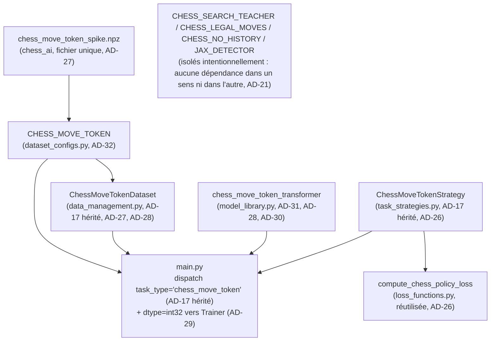

# Architecture Spine — Epic CHESS_MOVE_TOKEN — transformer causal sur historique de coups

## Design Paradigm

L'entraînement reste **Strategy + Factory + Dependency Injection** (`main.py`/`Trainer`/`TaskStrategy`/`model_library.get_model()`), hérité sans changement des deux spines parents — le domaine `chess_move_token` s'y insère comme une nouvelle stratégie/classe/config de plus, jamais une exception au pattern. C'est le second test de généricité de ce pattern sur le domaine échecs (après Epic 9/10) : cette fois sur une modalité d'entrée entièrement différente (séquence d'entiers de longueur variable, pas un plan 8×8×C).

La nouveauté architecturale locale est confinée au **modèle** : un **décodeur transformer causal** (masquage causal + self-attention multi-têtes) sur la séquence `move_tokens`, lisant l'état caché du **dernier token réel** pour produire une seule prédiction policy (4672 classes) — pas une tête value, pas de génération autorégressive complète. Première utilisation d'un masque causal dans ce codebase (l'attention existante, `chess_cnn_attention_policy_value`, est un encodeur bidirectionnel style Perceiver/TokenLearner). `flax.linen` fournit déjà `nn.make_causal_mask`/`nn.combine_masks` et `nn.MultiHeadDotProductAttention` accepte un argument `mask` (vérifié : flax 0.10.7 installé) — aucune nouvelle dépendance.

## Inherited Invariants

| Inherited | From parent | Binds here |
| --- | --- | --- |
| AD-3 [ADOPTED] | architecture-jax_supervised_training-2026-07-15 (via architecture-JAX_Detection-2026-07-12) | Le chargement du checkpoint `chess_move_token` applique le même fallback de chemin 3 niveaux + réinit des `batch_stats` manquants que tout autre modèle — aucun chargement nu spécifique. |
| AD-14 | architecture-jax_supervised_training-2026-07-15 | `chess_move_token` s'entraîne comme une config/stratégie séparée et modulaire, jamais fusionnée à l'entraînement d'un autre domaine ou d'une autre stratégie échecs existante. |
| AD-17 | architecture-jax_supervised_training-2026-07-15 (restaté avec correction par architecture-chess-2026-07-27) | Le domaine `chess_move_token` obtient sa propre classe `TaskStrategy` et sa propre classe de chargeur de données — jamais une branche conditionnelle sur `ChessPolicyValueStrategy`/`ChessLegalMovesStrategy`/`ClassificationStrategy`/etc. existantes. 3 points de branchement réels vérifiés dans le code actuel : `main.py:141-200` (sélection `Strategy` par `task_type`), `data_management.py:867-940` (sélection classe chargeur par `task_type`), `model_library.py` `MODELS` (dict, nouvelle entrée — pas un `if/elif`, correction à cet endroit précis par rapport au texte hérité). |
| AD-18 | architecture-jax_supervised_training-2026-07-15 (via architecture-chess-2026-07-27) | Le format d'échange producteur/consommateur reste défini par un module dédié unique côté producteur — mais ce module (`chess_target_encoding.py`, `NUM_MOVES`/`move_to_index`) a été **relocalisé dans `chess_ai`** depuis le split (2026-08-09, `tests/test_no_chess_dependency.py`) : `jax_supervised_training` ne le réimplémente jamais, il consomme `move_tokens`/`policy` comme des entiers opaques déjà dans l'espace 4672, exactement comme il consomme déjà `position`/`policy` pour `CHESS_SEARCH_TEACHER`. |
| AD-21 | architecture-chess-2026-07-27 | `CHESS_SEARCH_TEACHER`, `CHESS_LEGAL_MOVES`, `CHESS_NO_HISTORY` et `JAX_DETECTOR` (et toutes leurs classes `Strategy`/chargeur/modèle) restent pleinement fonctionnels, sans aucune modification, pendant et après cette epic — même précédent, étendu ici à tous les domaines échecs existants (pas seulement `JAX_DETECTOR`). Validé par exécution réelle, pas par lecture de code seule. |
| AD-22 | architecture-chess-2026-07-27 | La tête policy produit un vecteur de taille fixe sur l'espace de coups AlphaZero (4672, `NUM_MOVES`), loss cross-entropy simple contre l'index du coup joué, sans masquage des coups illégaux — principe repris à l'identique ici (AD-30 ci-dessous en précise la variante coup-token). |

## Invariants & Rules

### AD-26 — `TaskStrategy` dédiée `chess_move_token`, policy-only (pas de tête value)

- **Binds:** nouvelle classe `ChessMoveTokenStrategy` (`task_strategies.py`), `compute_chess_policy_loss` (`loss_functions.py:561`, réutilisée telle quelle), `main.py` (nouvelle branche `task_type == "chess_move_token"`)
- **Prevents:** un builder qui réutilise `ChessPolicyValueStrategy`/`compute_chess_policy_value_loss` en neutralisant la value par poids nul (pattern `CHESS_SEARCH_TEACHER`) — non pertinent ici, confirmé par `chess_ai/SPEC.md` Non-goals ("refonte de la loss ou de la tête value" hors scope) : ce modèle n'a simplement **aucune** tête value, ce n'est pas une neutralisation ; un builder qui réimplémente une fonction de cross-entropy locale au lieu de réutiliser `compute_chess_policy_loss` déjà existante.
- **Rule:** `outputs` du modèle est un **tenseur unique** `(B, 4672)` — jamais un dict `{"policy", "value"}` (même forme que `ChessLegalMovesStrategy`, pas `ChessPolicyValueStrategy`). `compute_loss` délègue intégralement à `compute_chess_policy_loss(policy_logits, policy_targets, label_smoothing=...)` — aucune nouvelle fonction de loss créée. `primary_metric_name = "PolicyAccuracy"` (top-1, même formule que `ChessPolicyValueStrategy.compute_metrics`), `optimization_mode = "max"`.

### AD-27 — Chargeur `chess_move_token` : format CSR, fichier unique (pas de glob chunké)

- **Binds:** nouvelle classe `ChessMoveTokenDataset` (`data_management.py`), `data_management.py:867-940` (dispatch)
- **Prevents:** un builder qui suppose la convention `{output_prefix}_chunk*.npz` des autres chargeurs échecs (`ChessPolicyValueDataset`/`ChessLegalMovesDataset`) — le dataset spike est **un seul fichier** `.npz` (`chess_move_token_spike.npz`), pas des chunks ; un builder qui matérialise `move_tokens`/`move_token_offsets` en séquences paddées AVANT le pipeline `tf.data` (mémoire inutile, 309988 tokens à plat pour 3190 positions — reconstruire les séquences à la volée depuis les offsets CSR dans `gen()`, comme les autres chargeurs matérialisent déjà un chunk entier par itération).
- **Rule:** `ChessMoveTokenDataset` accepte un chemin de fichier `.npz` unique (pas un `output_prefix` glob) tant que le dataset reste le spike (voir AD-32, statut expérimental). Découpe `move_tokens[move_token_offsets[i]:move_token_offsets[i+1]]` par position dans `gen()`, **mélange les index d'exemples avec une graine fixe reproductible AVANT le split fraction train/val** (même convention que `ChessPolicyValueDataset`/`ChessLegalMovesDataset`, qui mélangent leurs chunks avant split pour éviter un biais d'ordre déjà documenté le 2026-07-27 — ici au grain de l'exemple, pas du chunk, un seul fichier ne permettant pas de chunks). `create_tf_dataset` produit des séquences de longueur variable (`tf.TensorSpec(shape=(None,), dtype=tf.int32)`), paddées dynamiquement par batch (AD-28) — jamais un `max_len` global fixe en dur dans la config.

### AD-28 — Batching : padding à longueur FIXE GLOBALE, à GAUCHE (recette explicite reverse/pad/reverse)

- **Binds:** `ChessMoveTokenDataset.create_tf_dataset`, modèle `chess_move_token_transformer`, `Trainer._train_step` (`@jax.jit`, lu, jamais modifié)
- **Prevents:** un builder qui padde à droite (convention "naturelle" mais qui oblige à indexer l'état caché du dernier token réel via un `gather` à `longueur_réelle - 1`, source d'erreurs off-by-one) ; un builder qui suppose que `tf.data.Dataset.padded_batch` sait padder à gauche nativement — **vérifié : ce n'est pas le cas, il padde toujours à droite** ; un builder qui pool (moyenne/max) sur toute la séquence au lieu de lire un seul token ; deux builders qui font le masque de padding chacun à sa façon ; **un builder qui padde dynamiquement à la longueur max DU BATCH COURANT** (`padded_shapes=([None], [])`, version initiale de cet AD) — **vérifié critique par exécution réelle (Aymeric, nvtop, 2026-08-10)** : `Trainer._train_step` est `@jax.jit`, qui compile un nouvel exécutable XLA pour chaque forme d'entrée distincte jamais vue ; avec une longueur de batch variable (dataset : min=4, médiane=86, max=301), la forme `(B, L)` change quasiment à chaque step → recompilation à chaque step (GPU à 0% ~5s par step observé, débit ~3.7s/it au lieu de quelques dizaines de ms).
- **Rule:** longueur de séquence **fixe et globale pour tout le run** (`self.max_seq_len`, `ChessMoveTokenDataset.__init__`), calculée depuis les vraies données (`max(longueur d'historique) + 1` pour `BOS` — jamais un littéral en dur type `301`, qui deviendrait silencieusement faux si le dataset spike changeait). `padded_batch(..., padded_shapes=([self.max_seq_len], []))` — une seule forme de batch pour tout le run, donc **une seule compilation JIT**. Recette de padding à gauche (inchangée) : (1) préfixer `BOS_TOKEN_ID` à chaque séquence `move_tokens` de la position ; (2) `tf.reverse()` la séquence ; (3) `padded_batch(..., padding_values=PAD_TOKEN_ID)` (padde à droite, donc "avant" en ordre inversé = "après" une fois ré-inversé) ; (4) `tf.reverse()` chaque séquence du batch obtenu. Résultat : padding à gauche, `BOS` immédiatement après le padding, tokens réels dans l'ordre original, dernier token réel toujours à l'indice `-1`. `BOS_TOKEN_ID`/`PAD_TOKEN_ID` = les constantes uniques d'AD-30, jamais des littéraux recopiés ici. Le **masque** (causal `nn.make_causal_mask` + padding) est construit **entièrement à l'intérieur du modèle**, dérivé directement du tenseur d'entrée (`tokens != PAD_TOKEN_ID`) — jamais un second tenseur de masque acheminé via `ChessMoveTokenStrategy`/`Trainer` (la signature `apply_fn(vars, images, ...)` ne transporte qu'un seul tenseur d'entrée, zero-touch Trainer, AD-29). La tête policy lit `hidden_states[:, -1, :]` — jamais un pooling moyen ni un `gather` par longueur.

### AD-29 — `Trainer.dtype` : `int32` pour `chess_move_token`, pas le `float16` par défaut

- **Binds:** `main.py` (construction de `Trainer`, actuellement `dtype=dtype` où `dtype` est fixé en dur à `jnp.float16` pour TPU et GPU, `main.py:35-41`), `trainer.py` (lu, jamais modifié)
- **Prevents:** un builder qui laisse `chess_move_token` hériter du `dtype=jnp.float16` par défaut de tous les autres domaines — **vérifié critique** : `trainer.py:313`/`430` fait `images = jnp.array(images_np, dtype=self.dtype)` **inconditionnellement**, avant tout hook `Strategy`. `float16` ne représente exactement les entiers que jusqu'à ~2048 (au-delà, seuls les multiples de 4 le sont jusqu'à 8192) — la quasi-totalité de l'espace de tokens (0-4673, y compris `BOS`/`PAD`) serait silencieusement corrompue par ce cast, sans erreur ni warning. Aucun domaine existant n'a ce problème (leurs entrées sont des plans flottants continus, pas des indices entiers discrets) — c'est pourquoi ce n'était pas déjà couvert par AD-3/AD-21.
- **Rule:** `main.py` passe `dtype=jnp.int32` (au lieu de la valeur `float16` en dur) à la construction de `Trainer` quand `task_type == "chess_move_token"` — branche locale à `main.py`, aucune modification de `trainer.py` (son paramètre `dtype` est déjà générique, zero-touch préservé). `int32 → int32` via `jnp.array` est un no-op, aucune perte de précision. Ce point est vérifié par exécution réelle avant toute story de modélisation (un batch de tokens connus, non ambigus après passage par le pipeline `Trainer`).

### AD-30 — Tokens spéciaux : `BOS`/`PAD` en entrée seulement, sortie policy inchangée (4672)

- **Binds:** table d'embedding d'entrée du modèle `chess_move_token_transformer`, `ChessMoveTokenDataset` (construction de séquence), tête de sortie policy
- **Prevents:** un builder qui ajoute `BOS`/`PAD` à l'espace de sortie policy (romprait la comparabilité avec `CHESS_SEARCH_TEACHER`/`CHESS_LEGAL_MOVES`, qui utilisent tous les 4672 classes identiques, AD-22) ; un builder qui active le weight-tying embedding↔tête de sortie par défaut alors que les deux espaces ne coïncident plus une fois les spéciaux ajoutés (4674 en entrée vs 4672 en sortie) — asymétrie déjà là au design, pas une régression à corriger.
- **Rule:** espace d'entrée (embedding) = `NUM_MOVES + 2 = 4674` : `BOS_TOKEN_ID = 4672` (préfixé à chaque séquence avant padding, AD-28), `PAD_TOKEN_ID = 4673`. Pas de token `EOS` (pas de génération jusqu'à fin de partie — lecture d'historique à prédiction unique, CAP-3). La tête de sortie policy reste un `Dense(4672)` strict — ne prédit jamais `BOS`/`PAD`. Pas de weight-tying par défaut (voir Deferred). **Source unique des constantes :** `BOS_TOKEN_ID`/`PAD_TOKEN_ID` définies une seule fois (`data_management.py`, aux côtés de `ChessMoveTokenDataset` qui construit les séquences) — le modèle (`model_library.py`) les importe, ne les redéfinit jamais comme littéraux indépendants (même discipline que `NUM_MOVES`, AD-22 hérité).

### AD-31 — Modèle `chess_move_token_transformer` : décodeur causal, masquage flax natif

- **Binds:** nouvelle classe modèle (`model_library.py`, ajoutée au dict `MODELS`), `model_kwargs` (`main.py`)
- **Prevents:** un builder qui écrit son propre masque causal à la main (risque d'erreur, ex. inclusion de la diagonale) au lieu de `nn.make_causal_mask` ; un builder qui introduit une dépendance externe (`transformers`, etc.) pour un simple décodeur causal — `flax.linen` suffit (vérifié, flax 0.10.7).
- **Rule:** embedding (`nn.Embed`, vocab 4674, AD-30) → N blocs décodeur causal standard (self-attention masquée via `nn.MultiHeadDotProductAttention(mask=...)` + MLP + résiduel/norm, `flax.linen`) → lecture du dernier token réel (AD-28) → `Dense(4672)`. Hyperparamètres (nombre de blocs, `d_model`, nombre de têtes, dropout) sont du **seed** : valeurs de départ raisonnables dans `dataset_configs.py`/`CHESS_MOVE_TOKEN`, non figées ici, ajustées empiriquement comme tous les autres hyperparamètres échecs (`token_dim`, `num_bottleneck_tokens` de `CHESS_SEARCH_TEACHER`).

### AD-32 — Statut expérimental : config marquée spike, non promue avant verdict CAP-4/CAP-5

- **Binds:** `CHESS_MOVE_TOKEN` (`dataset_configs.py`)
- **Prevents:** un builder qui traite `CHESS_MOVE_TOKEN` comme une config stable au même titre que `CHESS_SEARCH_TEACHER` (ex. la documente dans un contrat, la branche dans un outil `chess_ai` côté inférence) avant que le spike ne soit jugé concluant côté `chess_ai` (`spec-chess-move-token-poc/SPEC.md`, Success signal : CAP-4 ET CAP-5 réunis).
- **Rule:** le commentaire d'en-tête de `CHESS_MOVE_TOKEN` dans `dataset_configs.py` déclare explicitement son statut SPIKE/PROVISOIRE (même formule que `docs/spike-chess-move-token-dataset-schema.md`) et référence ce spine. `output_prefix`/chemin pointe sur le fichier spike unique (AD-27) — pas de régénération à pleine échelle dans cette epic (hors scope, non-goal côté `chess_ai`).

### AD-33 — Le modèle caste son entrée en `int32` lui-même, indépendamment du dummy d'init `Trainer`

- **Binds:** `chess_move_token_transformer.__call__` (`model_library.py`)
- **Prevents:** un builder qui suppose qu'AD-29 (dtype `int32` passé à `Trainer` pour la boucle réelle) suffit à garantir un dtype entier partout — **vérifié faux par exécution réelle** : `Trainer.create_train_state()` construit son dummy d'initialisation via `jnp.ones((1,) + input_shape, jnp.float32)` (`trainer.py:145`), **hors du chemin couvert par AD-29** (qui ne couvre que `trainer.py:313`/`430`, la boucle d'entraînement). `nn.Embed.init()` lève `ValueError: Input type must be an integer or unsigned integer` sur cette entrée `float32` — testé, le pipeline crasherait dès le premier appel à `create_train_state`, avant le premier step.
- **Rule:** `chess_move_token_transformer.__call__` caste son entrée en `int32` dès sa première ligne (`x = jnp.asarray(x, dtype=jnp.int32)`), quel que soit le dtype fourni par l'appelant. Le dummy d'init (`1.0` → `1`, token valide dans le vocab 4674) et les vraies données (déjà `int32` après AD-29) passent tous deux par ce même cast — idempotent, sans coût, sans dépendre de l'appelant. `trainer.py` reste non modifié (zero-touch préservé, même discipline qu'AD-29).

### Dépendances (qui peut dépendre de qui)



## Consistency Conventions

| Concern | Convention |
| --- | --- |
| Naming | `task_type="chess_move_token"` ; classe stratégie `ChessMoveTokenStrategy` ; classe chargeur `ChessMoveTokenDataset` ; nom modèle `chess_move_token_transformer` — même convention `Chess<Rôle>` que `ChessPolicyValueStrategy`/`ChessLegalMovesStrategy`/`chess_cnn_attention_policy_value`. |
| Data & formats | Vocabulaire d'entrée = espace policy (4672) + `BOS=4672` + `PAD=4673` (AD-30). Séquences paddées à gauche (AD-28). `move_token_offsets` = bornes CSR, jamais réinterprétées comme des longueurs directement (toujours `offsets[i+1]-offsets[i]`). |
| State & cross-cutting | `loss_params` en dict passé à l'instanciation de la stratégie — même pattern que `ChessLegalMovesStrategy.__init__(loss_params=...)`. Aucune modification de `trainer.py` (même discipline "zero-touch Trainer" qu'AD-24 du spine chess). |

## Stack

| Name | Version |
| --- | --- |
| flax.linen | 0.10.7 (installé, `jax_env`) — `nn.make_causal_mask`/`nn.combine_masks`/`nn.MultiHeadDotProductAttention(mask=...)` déjà disponibles, aucune nouvelle dépendance |
| jax | 0.6.2 (installé, `jax_env`) |
| tensorflow (tf.data) | 2.20.0 (installé, `jax_env`) — `padded_batch` vérifié disponible, utilisé selon la recette AD-28 (padde à droite nativement, jamais à gauche) |

## Structural Seed

```text
jax_supervised_training/
  dataset_configs.py        # + entrée CHESS_MOVE_TOKEN (AD-32)
  data_management.py        # + classe ChessMoveTokenDataset (AD-27, AD-28)
  model_library.py          # + classe modèle dans MODELS (AD-31, AD-33)
  task_strategies.py        # + classe ChessMoveTokenStrategy (AD-26)
  main.py                   # + branche task_type == "chess_move_token" (main.py:141-200)
                             # + dtype=jnp.int32 (pas le float16 en dur, main.py:35-41) pour ce task_type (AD-29)
  loss_functions.py         # inchangé — compute_chess_policy_loss réutilisée telle quelle (AD-26)
```

## Capability → Architecture Map

| Capability / Area | Lives in | Governed by |
| --- | --- | --- |
| CAP-3 (chess_ai spec) — transformer causal, prédiction du coup suivant depuis l'historique | `chess_move_token_transformer` (model_library.py) + `ChessMoveTokenStrategy` (task_strategies.py) | AD-26, AD-28, AD-30, AD-31, AD-33 |
| Chargement dataset spike (CSR, fichier unique) | `ChessMoveTokenDataset` (data_management.py) | AD-27 |
| Non-régression domaines échecs existants + JAX_DETECTOR | `CHESS_SEARCH_TEACHER`/`CHESS_LEGAL_MOVES`/`CHESS_NO_HISTORY`/`JAX_DETECTOR` (dataset_configs.py) et leurs classes associées | AD-21 (hérité) |

## Deferred

- **Flax Linen vs Flax NNX** — Google oriente son investissement long-terme vers NNX ; Linen n'est pas déprécié à court terme (vérifié) et reste 100% cohérent avec le reste du codebase (déjà tout en Linen). Pas un blocker pour ce spike ; à surveiller si un futur chantier plus lourd sur ce modèle voit le jour.
- **Bucketing par longueur** — devenu moins urgent depuis le passage à une longueur fixe globale (AD-28, 2026-08-10) : le coût dominant identifié par exécution réelle était la recompilation JIT par forme variable, pas le gâchis de calcul du padding lui-même, et une longueur fixe règle déjà ce problème pour un dataset de cette taille (3190 positions, max réel 301). Le bucketing resterait pertinent seulement pour réduire le gâchis de *calcul* (pas de compilation) si le dataset est regénéré à plus grande échelle avec une variance de longueur similaire — à mesurer avant d'investir dedans, pas supposé.
- **Weight-tying** embedding d'entrée ↔ tête de sortie policy — asymétrie 4674/4672 délibérée (AD-30) ; option explicitement ouverte (pas imposée) par `chess_ai` CAP-3, à réévaluer seulement si un premier run donne un signal encourageant justifiant l'investissement.
- **Token `EOS` / génération autorégressive complète** — hors scope tant que l'objectif reste une lecture d'historique à prédiction unique (pas de self-play génératif avec ce modèle cette epic).
- **Régénération du dataset à pleine échelle, synchro du contrat d'interface stable (`contract-chess-ai-training-interface.md`), intégration inférence** — explicitement Non-goals côté `chess_ai` (SPEC.md) ; ne deviennent pertinents que si le spike est jugé concluant (CAP-4 ET CAP-5), auquel cas ce spine sera mis à jour ou remplacé par un spine "epic complet".
- **Hyperparamètres du transformer** (nombre de blocs, `d_model`, têtes, dropout, learning rate/schedule) — seed, valeurs de départ non tunées dans `dataset_configs.py`, ajustées empiriquement comme le reste du domaine échecs (précédent `token_dim`/`num_bottleneck_tokens`).
