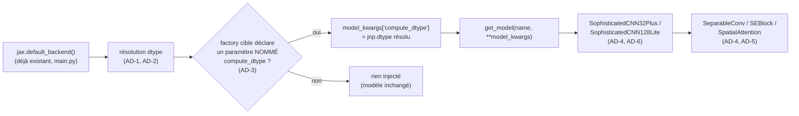

# Architecture Spine — compute-dtype-hardware

## Design Paradigm

**Progressive Enhancement via Centralized, Capability-Probed Injection.** `main.py` détecte le matériel une seule fois (déjà en place) et résout `compute_dtype` une seule fois ; il n'injecte cette valeur qu'aux modèles qui déclarent explicitement pouvoir la recevoir, détecté par introspection de signature — jamais par registre maintenu à la main, jamais par un flag de config par dataset. Un modèle qui ne déclare pas le champ n'est simplement pas concerné : ni cassé, ni faussement amélioré. Chaque futur modèle adapté « s'enrichit » automatiquement dès qu'il déclare le champ, sans retoucher le point d'injection.

**Révision actée d'une décision du SPEC (2026-08-17).** `SPEC-compute-dtype-hardware` (OQ1) avait initialement tranché pour un forwarding *inconditionnel* ("quel que soit le modèle... pas d'opt-in par registre/introspection"). L'audit brownfield mené pendant cette spine a montré que la lecture littérale de cette décision casserait aujourd'hui 6 des 12 modèles de `MODELS` (aucun `**kwargs`, aucun champ `compute_dtype`) — contredisant directement l'objectif de non-régression du SPEC lui-même pour CAP-2. AD-3 ci-dessous renverse donc OQ1 en connaissance de cause ; `SPEC.md` doit être remis à jour (via `bmad-spec`) pour refléter ce renversement plutôt que rester un contrat daté et contredit.

## Invariants & Rules



### AD-1 — Dérivation matérielle unique, aucune string en config, aucun opt-out par config [ADOPTED]

- **Binds:** tout modèle consommant `compute_dtype` (aujourd'hui : `ChessMoveTokenTransformer`, `SophisticatedCNN32Plus`, `SophisticatedCNN128Lite`)
- **Prevents:** une string codée en dur par config qui dérive du matériel réel (déjà arrivé : `CHESS_MOVE_TOKEN` forçait `"bfloat16"` sans vérifier le backend) ; un flag de config réintroduit plus tard sous couvert d'« exception »/opt-out pour un modèle particulier
- **Rule:** `main.py` dérive `compute_dtype` depuis `jax.default_backend()` (même détection que le bloc existant `main.py:31-41`) — `bfloat16` si `backend == "tpu"`, `float32` sinon (GPU et CPU inclus — prudence de projet documentée, pas une limite matérielle). Aucune config de dataset ne déclare `compute_dtype` ; le littéral `"compute_dtype": "bfloat16"` de `CHESS_MOVE_TOKEN` (`dataset_configs.py`) est supprimé. La SEULE façon sanctionnée pour un modèle d'être exempté est de ne pas déclarer le paramètre nommé `compute_dtype` (mécanisme AD-3) — aucun flag de config n'est jamais un levier légitime, y compris présenté comme une exception ponctuelle.

### AD-2 — Résolution centralisée pour les nouveaux adoptants, précédent existant préservé [ADOPTED]

- **Binds:** `main.py`, toute factory nouvellement adaptée (`sophisticated_cnn_32_plus`, `sophisticated_cnn_128_lite`, et au-delà)
- **Prevents:** chaque nouvelle factory ré-implémentant sa propre résolution/validation string→`jnp.dtype`
- **Rule:** `main.py` résout la string dérivée en véritable `jnp.dtype` une seule fois ; c'est ce `jnp.dtype` déjà résolu qui circule dans `model_kwargs` pour tout modèle recevant `compute_dtype` par injection. Les nouvelles factories (CIFAR10, FIGHTERJET) reçoivent ce `jnp.dtype` directement, sans validation propre. **La résolution/validation existante de `create_chess_move_token_transformer` (`model_library.py:1218-1221`, `getattr(jnp, compute_dtype)` + `ValueError` explicite) N'EST PAS retirée** — elle reste couverte par `tests/test_chess_move_token_model.py::test_compute_dtype_factory_rejects_unknown_string`, qui teste l'appel direct hors `main.py` ; ce chemin d'appel direct reste un cas d'usage légitime que cette factory doit continuer à protéger.

### AD-3 — Forwarding par introspection stricte du paramètre nommé, avec preuve d'effet réel

- **Binds:** point d'injection `main.py` → `get_model`
- **Prevents:** (a) casser un modèle dont la factory ne supporte pas encore `compute_dtype` ; (b) un registre/allowlist maintenu à la main qui dérive de la réalité du code ; (c) le piège d'absorption silencieuse déjà présent dans ce fichier (`aircraft_detector_unet`/`centernet`/`centernet_lite` acceptent `**kwargs` mais ne le transmettent jamais à leur constructeur) ; (d) un paramètre nommé `compute_dtype` mais jamais réellement transmis au `nn.Module` sous-jacent — la même absorption silencieuse, un niveau plus bas, indétectable en logs
- **Rule:** `main.py` inspecte la signature de la factory cible et vérifie la présence d'un paramètre **nommé explicitement** `compute_dtype` (pas la simple présence d'un `**kwargs` catch-all). N'injecte que si ce paramètre nommé existe. **Mais nommer le paramètre ne suffit pas** : tout modèle adoptant `compute_dtype` doit avoir un test dédié qui vérifie que le dtype est **réellement observé** (params/sortie diffèrent sous `bfloat16` vs `float32`) — même patron que `tests/test_chess_move_token_model.py::test_compute_dtype_bfloat16_params_and_output_stay_float32` (ligne 207) — pas seulement l'absence d'erreur à l'appel.

### AD-4 — compute_dtype réservé aux couches matmul lourdes (Conv/Dense), jamais à la normalisation [ADOPTED]

- **Binds:** toute classe (top-level ou sous-module partagé) gagnant `compute_dtype` — aujourd'hui `SophisticatedCNN32Plus`, `SophisticatedCNN128Lite`, `SeparableConv`, `SEBlock`, `SpatialAttention` ; s'applique automatiquement à tout futur adoptant sans réécrire cette règle
- **Prevents:** un traitement spécial ad hoc et incohérent de la normalisation d'un modèle à l'autre ; une propagation partielle silencieuse (un site d'appel oublié dans un sous-module produit un mix bfloat16/float32 sans erreur ni log)
- **Rule:** `dtype=self.compute_dtype` s'applique à **tout** appel `nn.Conv`/`nn.Dense`, **où qu'il apparaisse** — y compris à l'intérieur des sous-modules partagés (AD-5) — jamais à `nn.BatchNorm`/`nn.LayerNorm`/`nn.Embed`. Ratifie le principe déjà établi par le précédent adopté (`ChessMoveTokenTransformer`, docstring `model_library.py:1107-1123`) : la raison de l'exclusion n'est pas un risque numérique (Flax protège déjà les réductions de `BatchNorm`/`LayerNorm` en `float32` en interne, `force_float32_reductions=True` par défaut — vérifié, `flax.readthedocs.io`, `apxml.com/courses/advanced-jax`, `github.com/google/flax/discussions/3987`) mais que seules les couches matmul lourdes bénéficient réellement d'un calcul en précision réduite. Règle par TYPE de couche, pas par nom de classe — se généralise d'elle-même à tout futur modèle sans amendement.

### AD-5 — Les sous-modules partagés reçoivent `compute_dtype` explicitement, à CHAQUE site d'appel

- **Binds:** `SeparableConv`, `SEBlock`, `SpatialAttention`
- **Prevents:** une classe parente qui perd le contrôle de la précision à la frontière d'un sous-module composé ; une propagation partielle (certains sites d'appel oubliés) invisible et non détectée par AD-3 seul
- **Rule:** chaque sous-module partagé déclare son propre champ `compute_dtype: Any = jnp.float32` et l'applique (AD-4) à ses appels `nn.Conv`/`nn.Dense` internes. La classe parente passe `compute_dtype=self.compute_dtype` explicitement à **chaque** instanciation (ex. `SeparableConv(48, (3, 3), compute_dtype=self.compute_dtype)`) — jamais hérité implicitement. Un futur parent (ex. `SophisticatedCNN128Plus`, Deferred) qui oublie un seul site d'appel produit un mix silencieux de précisions : le test requis par AD-3 (comparaison réelle bfloat16 vs float32) est la protection contre ce risque, pas la seule relecture du diff.

### AD-6 — Invariants poids/checkpoint [ADOPTED]

- **Binds:** toute classe gagnant `compute_dtype`
- **Prevents:** rupture de compatibilité checkpoint ; poids stockés en précision réduite (sous-flux/instabilité optimiseur)
- **Rule:** `compute_dtype` est un champ de configuration statique du `dataclass` (jamais un `nn.Param`) — absent du pytree des paramètres, donc les checkpoints existants (CIFAR10, FIGHTERJET_CLASSIFICATION) restent chargeables sans changement de forme. Les poids maîtres restent `float32` dans tous les cas ; seul le calcul (forward/backward) utilise `compute_dtype`. Même garantie que le précédent `ChessMoveTokenTransformer`.

### AD-7 — Non-régression CHESS_MOVE_TOKEN [ADOPTED]

- **Binds:** `CHESS_MOVE_TOKEN` / `ChessMoveTokenTransformer`
- **Prevents:** changement de comportement ou de couverture de test sur l'unique consommateur existant de `compute_dtype`
- **Rule:** après centralisation (AD-1, AD-2), `CHESS_MOVE_TOKEN` continue de recevoir `compute_dtype=bfloat16` sur TPU exactement comme avant, via le nouveau mécanisme central pour la dérivation — mais sa propre logique de validation interne (AD-2) et ses deux tests existants (`test_compute_dtype_factory_rejects_unknown_string`, `test_compute_dtype_bfloat16_params_and_output_stay_float32`) restent inchangés et verts.

## Consistency Conventions

| Concern | Convention |
| --- | --- |
| Naming | Le champ s'appelle `compute_dtype` partout (classes modèle, sous-modules, `model_kwargs`) — jamais renommé par classe. |
| Data & formats | Le `jnp.dtype` résolu circule seul au-delà de `main.py` ; la string (`"bfloat16"`/`"float32"`) n'existe que dans la logique de dérivation de `main.py`. Pour toute **nouvelle** factory (au-delà de `create_chess_move_token_transformer`, dont le défaut string existant est préservé — AD-2), le défaut propre du paramètre `compute_dtype` (utilisé si la factory est appelée hors du chemin `main.py`) doit déjà être un `jnp.dtype` résolu (ex. `jnp.float32`), jamais une string. |
| State & cross-cutting | `compute_dtype` est un concern de calcul par forward pass uniquement — jamais persisté dans un checkpoint/training_state. |

## Structural Seed

```text
jax_supervised_training/
  main.py             # détection matérielle (existante) + résolution unique + injection par introspection (AD-1, AD-2, AD-3) ; retire le bloc mort `if "compute_dtype" in config: ...` (main.py:154-160), obsolète après AD-1
  model_library.py     # SophisticatedCNN32Plus / SophisticatedCNN128Lite / SeparableConv / SEBlock / SpatialAttention gagnent compute_dtype (AD-4, AD-5, AD-6) ; create_chess_move_token_transformer INCHANGÉE (AD-2, AD-7)
  dataset_configs.py   # littéral "compute_dtype" retiré de CHESS_MOVE_TOKEN (AD-1, AD-7) ; CIFAR10/FIGHTERJET_CLASSIFICATION inchangées (dtype dérivé, jamais configuré)
  tests/                # nouveau test par modèle adapté : dtype réellement observé sous bfloat16 vs float32 (AD-3) ; tests existants ChessMoveTokenTransformer inchangés (AD-7)
```

## Capability → Architecture Map

| Capability / Area | Lives in | Governed by |
| --- | --- | --- |
| CAP-1 (sélection automatique par matériel) | `main.py` (détection + résolution + injection) | AD-1, AD-2, AD-3 |
| CAP-2 (mécanisme générique, validé CIFAR10 + FIGHTERJET_CLASSIFICATION) | `model_library.py` : `SophisticatedCNN32Plus`, `SophisticatedCNN128Lite`, `SeparableConv`, `SEBlock`, `SpatialAttention` | AD-3, AD-4, AD-5, AD-6 |

## Deferred

- **Rollout aux 9 autres modèles de `MODELS`** (`aircraft_detector_unet`/`centernet`/`centernet_lite`, `chess_cnn_attention_policy_value`/`legal_moves`, `chess_token_candidate_model`, `chess_token_one_move_model`, `kepler_1d_cnn`, `sophisticated_cnn_128_plus`) — non touchés par cette spine (AD-3 garantit qu'ils ne cassent pas). Décision à reprendre modèle par modèle, séquencement voulu par Aymeric après revue de l'impact CIFAR10/FIGHTERJET. Pour `sophisticated_cnn_128_plus` en particulier, qui compose les mêmes sous-modules partagés (`SeparableConv`/`SEBlock`/`SpatialAttention`, ~9 sites d'appel) : AD-5 s'applique intégralement, un site d'appel oublié produirait un mix silencieux — le test requis par AD-3 est la garde-fou.
- **Bug pré-existant, sans rapport avec cette spine** : `aircraft_detector_unet`/`centernet`/`centernet_lite` acceptent déjà `**kwargs` en façade sans jamais le transmettre à leur constructeur (piège connu, ex. `num_classes` silencieusement perdu pour CenterNet). AD-3 protège `compute_dtype` de ce piège (introspection ne les cible pas), mais le bug lui-même reste entier — à corriger séparément si/quand ces modèles sont un jour adaptés.
- **bfloat16/float16 sur GPU** — hors scope explicite (non-goal du spec), aucune mesure faite à ce jour ; décision distincte et mesurée si un jour reprise.
- **Mise à jour de `SPEC-compute-dtype-hardware`** — AD-3 renverse la résolution OQ1 du SPEC ("unconditionnel, pas d'introspection") ; le SPEC doit être re-dérivé via `bmad-spec` pour documenter ce renversement et rester la source de vérité synchronisée avec cette spine.
- **Enveloppe opérationnelle (déploiement/environnements)** — inchangée : TPU via Colab, GPU/CPU en local, détection au cold-start déjà en place (`main.py:31-41`), réutilisée telle quelle.
